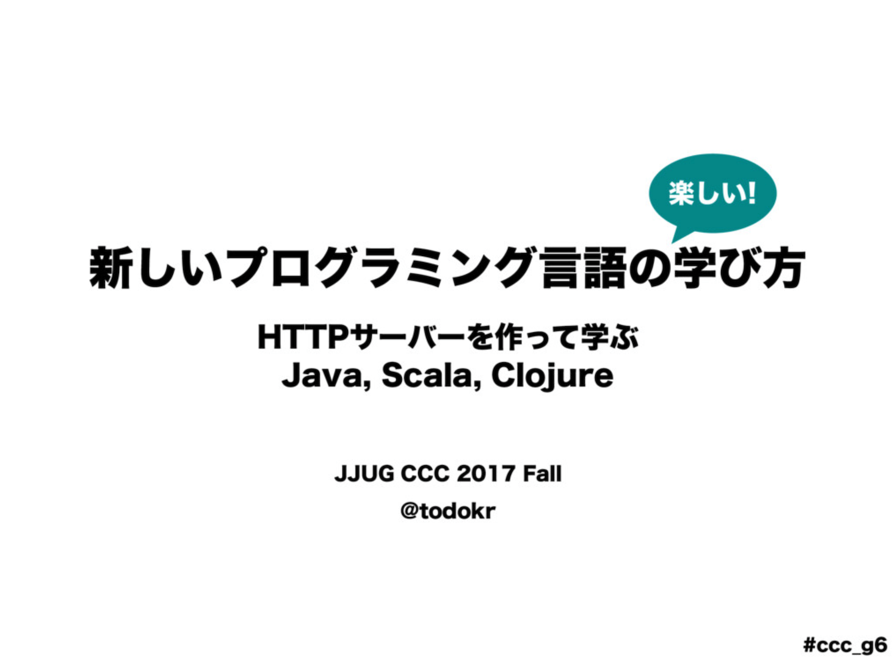

[JJUG CCC 2017 Fall「HTTPサーバーを作って学ぶ Java, Scala, Clojure」](https://speakerdeck.com/todokr/xin-siihurokuraminkuyan-yu-falsexue-hifang-httpsahawozuo-tutexue-hu-java-scala-clojure)

# Simple HTTP Server
言語学習用のシンプルなHTTPサーバーの実装例です。現在 Java, Scala, Clojureの実装があります。改善や他言語での実装など、PR歓迎です！

## 各言語のバージョン
- Java 14
- Scala 2.13.3
- Clojure 1.10.2

## 仕様
- localhost:8080で待ち受け、HTTPリクエストを受けとり、HTTPレスポンスを返す
- 対応するHTTPリクエストメソッドは`GET`のみ（それ以外のメソッドもGETとみなす）
- リソースのMIMEは外部ファイルで設定できる
- リクエストをブロックしない（マルチスレッド）
- Keep-Aliveはしない
- HTTP Cacheはしない

## 起動

- Java  
```
$ brew install homebrew/versions/maven32 # if you need
$ mvn compile
$ mvn exec:java
```

- Scala
```
$ brew install sbt # if you need
$ sbt run
```

- Clojure
```
$ brew install leiningen # if you need
$ lein run
```
